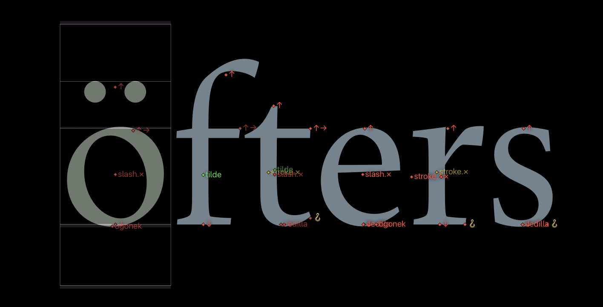
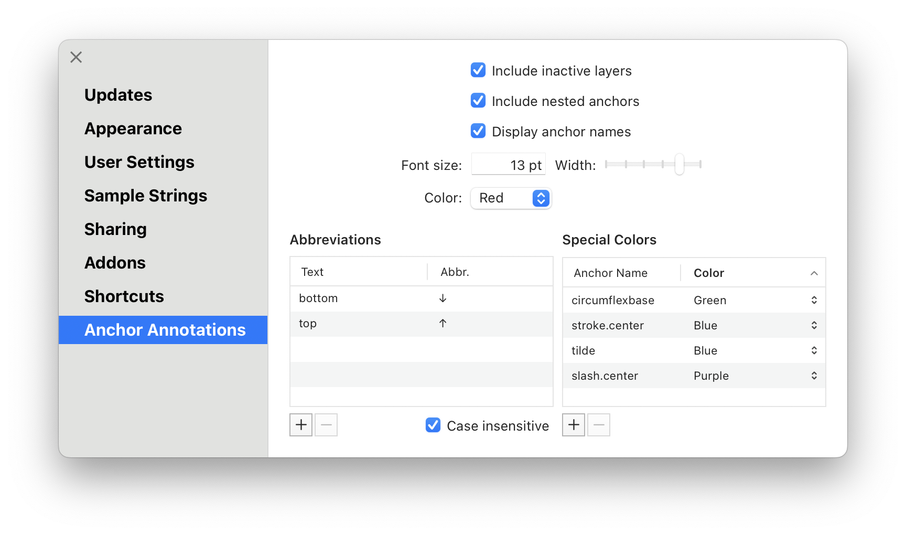

# Anchor Annotations

This is a plugin for [Glyphs](https://glyphsapp.com) that offers many customizable modes for displaying anchors in Edit View.

## Installation

Install the plugin using the button above or search for “Anchor Annotations” in the Plugin Manager.
Relaunch Glyphs for the plugin to be loaded.

## Usage

Activate and deactivate the plugin from the menu bar: *View* → *Show Anchor Annotations*.
You can assign a keyboard shortcut to this action in *Glyphs* → *Preferences…* → *Shortcuts* for quick access.

Anchors placed directly onto a layer appear as small diamond ◆ shapes.
Anchors that *shine through* from within components appear as downwards pointing triangle ⏷ shapes.

If there are multiple anchor names that would overlap one another, they are stacked vertically.
Anchor names that have been shifted are still connected to their original anchor position with a faint line.

## Localization

The plugin is available in Arabic, Czech, German, English, Spanish, French, Italian, Japanese, Korean, Portuguese, Russian (thanks [Victoria Lopukhina](https://vikavita.com)), Turkish, Chinese (simplified), and Chinese (traditional).

If you spot any issues with the existing localizations, let me know and I will fix them.

## Settings

Anchor Annotations offers a range of configurable settings.

### Include inactive layers

Select *Include inactive layers* if anchors from all layers should be shown, not only for the current layer.
On by default.

User defaults key: `AnchorAnnotationsIncludeInactiveLayers` (Boolean)

### Include nested anchors

Select *Include nested anchors* to show anchors which are included in component glyphs.
Note that not all anchors that are part of component glyphs are shown since some anchors might get overwritten by a different anchor of the same name on a higher nesting layer.
On by default.

User defaults key: `AnchorAnnotationsIncludeNestedAnchors` (Boolean)

### Display anchor names

Select *Display anchor names* to show the name of the anchors alongside their position.
The name of selected anchors will never be shown regardless of this setting.
On by default.

User defaults key: `AnchorAnnotationsDisplayAnchorNames` (Boolean)

### Font size

The *Font size* controls the size of the anchor names as displayed by the plugin.

User defaults key: `AnchorAnnotationsFontSize` (number in points)

### Font width

On recent macOS versions, you can change the font width at which the anchor names are displayed.
Pick a narrow width to reduce the risk of colliding anchor names.
Values range from 50% (full compression) to 100% (no compression); the default value is 100%.

User defaults key: `AnchorAnnotationsFontWidth` (number in percent)

### Color

The *Color* setting controls the color of the anchor points and anchor names.
The options are *Red*, *Orange*, *Brown*, *Yellow*, *Green*, *Mint*, *Teal*, *Cyan*, *Blue*, *Indigo*, *Purple*, *Pink*, and *Gray*.
Additionally, the *Text* option applies the current foreground color.

You can define custom colors for certain anchor names in the *Special Colors* section.

User defaults key: `AnchorAnnotationsGeneralColor` (number for each color: `1`: *Red*, `2`: *Orange*, …, `0`: *Text*)

### Abbreviations

The *Abbreviations* section lets you define text replacements for parts of anchor names.
These replacements do not affect the anchor name itself, only how it is displayed by the plugin.
Use arrows, dashes, or emoji to make anchor names stand out and take up less space visually.

The *Text* column of the table defines text patterns that get replaced by the respective entry in the *Abbr.* column.
Double-click an entry to edit it.

By default, “top” is shortened to “↑” and “bottom” is shortened to “↓”.
An anchor named `top` would thus appear as `↑` while an anchor named `bottomleft` would appear as `↓left`.

Add custom entries by clicking the plus button below the *Abbreviations* table.
To delete an entry, click on its row and then click the minus button.

Select the *Case insensitive* setting to perform these text replacements regardless of capitalization.
For example, with this setting selected and “top” mapping to “↑”, `TopLeft` would appear as `↑Left`.

User defaults keys: `AnchorAnnotationsAbbreviations` (dictionary with text patterns as keys and replacement strings as values); `AnchorAnnotationsAbbreviationsAreCaseInsensitive` (Boolean)

### Special Colors

In the *Special Colors* section you can define colors deviating from the main anchor color.
Add an entry and write the full name of an anchor in the *Anchor Name* column.
In the *Color* column, pick the color for anchors with this name.

User defaults key: `AnchorAnnotationsNameColors` (dictionary with anchor names as keys and color ids like for the *Colors* setting as values)

## Licenses

Licensed under the [Apache License, Version 2.0](http://www.apache.org/licenses/LICENSE-2.0).
